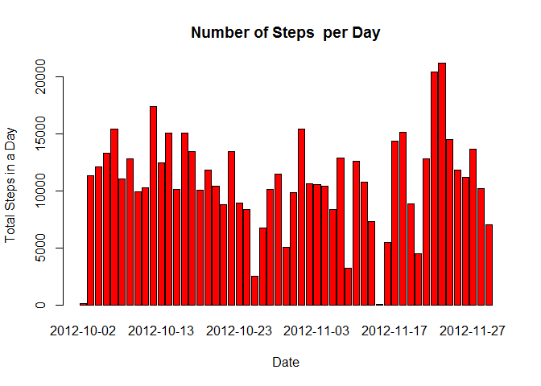

# Reproducible Research: Peer Assessment 1


## Loading and preprocessing the data
 Show any code that is needed to  
 1. Load the data (i.e. read.csv())  
 2. Process/transform the data (if necessary) into a format suitable for your analysis
 

```r
 library(data.table)
 library(ggplot2)
 library(lattice)
 library(knitr)
 opts_chunk$set(echo = TRUE, results = 'hold')
 
 activityData <- read.csv('./data/activity.csv', header = TRUE, sep = ",",
                         colClasses=c("numeric", "character", "numeric"))
```
 
A portion of the original dataset is as follows:

```
##   steps       date interval
## 1    NA 2012-10-01        0
## 2    NA 2012-10-01        5
## 3    NA 2012-10-01       10
## 4    NA 2012-10-01       15
## 5    NA 2012-10-01       20
## 6    NA 2012-10-01       25
```
  

The activity.csv file size is 3.50829\times 10^{5}    
Number of Rows in the file is 17568  


```
##      steps             date               interval    
##  Min.   :  0.00   Min.   :2012-10-01   0      :   61  
##  1st Qu.:  0.00   1st Qu.:2012-10-16   5      :   61  
##  Median :  0.00   Median :2012-10-31   10     :   61  
##  Mean   : 37.38   Mean   :2012-10-31   15     :   61  
##  3rd Qu.: 12.00   3rd Qu.:2012-11-15   20     :   61  
##  Max.   :806.00   Max.   :2012-11-30   25     :   61  
##  NA's   :2304                          (Other):17202
```
  

## I) What is mean total number of steps taken per day?
For this part of the assignment, you can ignore the missing values in the dataset.  
 1. Make a histogram of the total number of steps taken each day  
 2. Calculate and report the mean and median total number of steps taken per day  
 
Snippet of total number of steps taken per day  


```
##         date steps
## 1 2012-10-02   126
## 2 2012-10-03 11352
## 3 2012-10-04 12116
## 4 2012-10-05 13294
## 5 2012-10-06 15420
## 6 2012-10-07 11015
```
The Summary of the Data is:  


```
##       date                steps      
##  Min.   :2012-10-02   Min.   :   41  
##  1st Qu.:2012-10-16   1st Qu.: 8841  
##  Median :2012-10-29   Median :10765  
##  Mean   :2012-10-30   Mean   :10766  
##  3rd Qu.:2012-11-16   3rd Qu.:13294  
##  Max.   :2012-11-29   Max.   :21194
```

1. Make a histogram of the total number of steps taken per day,plotted with appropriate bin interval.  

 

2. Calculate and report the mean and median total number of steps taken per day  

```r
  print(meanSteps <- mean(steps_per_day$steps, na.rm=TRUE))
  print(medianSteps <- median(steps_per_day$steps, na.rm=TRUE))
```

```
## [1] 10766.19
## [1] 10765
```
The Mean of the total number of steps taken per day is : 1.0766189\times 10^{4} 
The Median of the total number of steps taken per day is : 1.0765\times 10^{4} 


## II) What is the average daily activity pattern?   

1. Make a time series plot (i.e. type = "l") of the 5-minute interval (x-axis) and the average number of steps taken, averaged across all days (y-axis)  


```r
  library(ggplot2)
  activityData <- read.csv('./data/activity.csv', header = TRUE, sep = ",", colClasses=c("numeric", "character", "numeric"))
  averages <- aggregate(x=list(steps=as.numeric(activityData$steps)),by=list(interval=as.numeric(activityData$interval)),FUN=mean, na.rm=TRUE)
  ggplot(data=averages, aes(x=interval, y=steps))+geom_line()+xlab("5-minute interval")+ylab("average number of steps taken")
```

 

2. Which 5-minute interval, on average across all the days in the dataset, contains the maximum number of steps?    


```r
  averages$interval[which.max(averages$steps)]
  averages[which.max(averages$steps),]
```

```
## [1] 835
##     interval    steps
## 104      835 206.1698
```

The interval with Maximum Steps is between: `r IntWithMaxSteps' and r uppLimitRange  

## III) Imputing missing values

1. Calculate and report the total number of missing values in the dataset (i.e. the total number of rows with NAs)  


```r
  sum(is.na(activityData))
```

```
## [1] 2304
```

2,3. Devise a strategy for filling in all of the missing values in the dataset. The strategy does not need to be sophisticated. For example, you could use the mean/median for that day, or the mean for that 5-minute interval, etc.    


```r
  # Replace each missing value with the mean value of its 5-minute interval

  stepValues <- data.frame(activityData$steps)   
  stepValues[is.na(stepValues),] <- ceiling(tapply(X=activityData$steps,INDEX=activityData$interval,FUN=mean,na.rm=TRUE))   
  newData <- cbind(stepValues, activityData[,2:3])   
  colnames(newData) <- c("steps", "date", "interval")
```

4. Make a histogram of the total number of steps taken each day and Calculate and report the mean and median total number of steps taken per day. Do these values differ from the estimates from the first part of the assignment? What is the impact of imputing missing data on the estimates of the total daily number of steps?  

a. Histogram with replaced NA values with mean value of its 5-minute interval 


```r
  steps_per_day_replaced <- aggregate(steps ~ date, data=newData, FUN=sum)
  colnames(steps_per_day_replaced) <- c("date","steps")
#   stepsDay = head(steps_per_day_replaced)
#   print(stepsDay)
  print(summary(steps_per_day_replaced))
  barplot(steps_per_day_replaced$steps, names.arg = steps_per_day_replaced$date, main="Number of Steps  per Day",xlab="Date", ylab="Total Steps in a Day", col="green")
```

 

```
##      date               steps      
##  Length:61          Min.   :   41  
##  Class :character   1st Qu.: 9819  
##  Mode  :character   Median :10909  
##                     Mean   :10785  
##                     3rd Qu.:12811  
##                     Max.   :21194
```

b. Calculate and report the mean and median total number of steps taken per day  


```r
  print(meanStepsRep <- mean(steps_per_day_replaced$steps, na.rm=TRUE))
  print(medianStepsRep <- median(steps_per_day_replaced$steps, na.rm=TRUE))
```

```
## [1] 10784.92
## [1] 10909
```
The Mean of the total number of steps taken per day is : 1.0784918\times 10^{4}       
The Median of the total number of steps taken per day is : 1.0909\times 10^{4}      

c. Do these values differ from the estimates from the first part of the assignment?  
Yes, these values differ.

d. What is the impact of imputing missing data on the estimates of the total daily number of steps?  
Adding the missing values to the original data "activityData" has caused both the mean and median values to increase.  
The Mean increased from 1.0766189\times 10^{4} to 1.0784918\times 10^{4}  
The Median increased from 1.0765\times 10^{4} to 1.0909\times 10^{4}  


##IV) Are there differences in activity patterns between weekdays and weekends?
For this part the weekdays() function may be of some help here. Use the dataset with the filled-in missing values for this part.  

1. Create a new factor variable in the dataset with two levels - "weekday" and "weekend" indicating whether a given date is a weekday or weekend day.  


```r
  dateDayType <- data.frame(sapply(X=newData$date, FUN=function(day) {
    if (weekdays(as.Date(day)) %in% c("Monday", "Tuesday", "Wednesday", "Thursday", "Friday")) {
      day <- "weekday"
    }
    else {
      day <- "weekend"
    } 
  }))
  
  newDataWithDayType <- cbind(newData, dateDayType)
  
  colnames(newDataWithDayType) <- c("steps", "date", "interval", "dayType")
```
  
  
A portion of this dataset is as follows:

```
##    steps       date interval dayType
## 1      2 2012-10-01        0 weekday
## 2      1 2012-10-01        5 weekday
## 3      1 2012-10-01       10 weekday
## 4      1 2012-10-01       15 weekday
## 5      1 2012-10-01       20 weekday
## 6      3 2012-10-01       25 weekday
## 7      1 2012-10-01       30 weekday
## 8      1 2012-10-01       35 weekday
## 9      0 2012-10-01       40 weekday
## 10     2 2012-10-01       45 weekday
## 11     1 2012-10-01       50 weekday
## 12     1 2012-10-01       55 weekday
## 13     1 2012-10-01      100 weekday
## 14     1 2012-10-01      105 weekday
## 15     1 2012-10-01      110 weekday
## 16     1 2012-10-01      115 weekday
## 17     0 2012-10-01      120 weekday
## 18     2 2012-10-01      125 weekday
## 19     2 2012-10-01      130 weekday
## 20     1 2012-10-01      135 weekday
```

2. Make a panel plot containing a time series plot (i.e. type = "l") of the 5-minute interval (x-axis) and the average number of steps taken, averaged across all weekday days or weekend days (y-axis). See the README file in the GitHub repository to see an example of what this plot should look like using simulated data.  


```r
  dayTypeIntervalSteps <- aggregate(data=newDataWithDayType,steps ~ dayType + interval,
      FUN=mean)
```
   A portion of the dataset is as follows:

```
##    dayType interval     steps
## 1  weekday        0 2.2888889
## 2  weekend        0 0.2500000
## 3  weekday        5 0.5333333
## 4  weekend        5 0.1250000
## 5  weekday       10 0.2888889
## 6  weekend       10 0.1250000
## 7  weekday       15 0.3111111
## 8  weekend       15 0.1250000
## 9  weekday       20 0.2222222
## 10 weekend       20 0.1250000
## 11 weekday       25 1.7111111
## 12 weekend       25 3.6250000
## 13 weekday       30 0.7555556
## 14 weekend       30 0.1250000
## 15 weekday       35 1.1555556
## 16 weekend       35 0.1250000
## 17 weekday       40 0.0000000
## 18 weekend       40 0.0000000
## 19 weekday       45 1.8666667
## 20 weekend       45 0.6250000
```

A panel plot of both weekend and weekday graphs is generated.


```r
  library("lattice")
  
  xyplot(
      type="l",
      data=dayTypeIntervalSteps,
      steps ~ interval | dayType,
      xlab="Interval",
      ylab="Number of steps",
      layout=c(1,2)
  )
```

 
